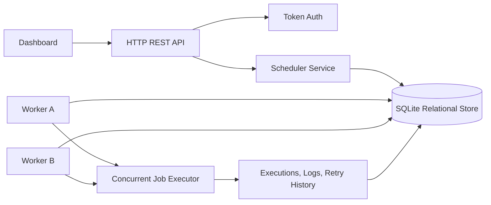

# Architecture Diagram

## Runtime Flow

1. Users authenticate and manage projects, queues, and jobs through REST APIs.
2. Jobs are stored in SQLite with status, timing, retry, and idempotency metadata.
3. Workers poll eligible queues and use `BEGIN IMMEDIATE` plus conditional status updates to atomically claim one job at a time.
4. Claimed jobs move to `running`, emit execution records and logs, then complete or fail.
5. Failed jobs use the queue retry policy. Exhausted jobs are moved to the dead letter queue.
6. The dashboard polls APIs for health, worker heartbeat, queue statistics, jobs, logs, and throughput.
