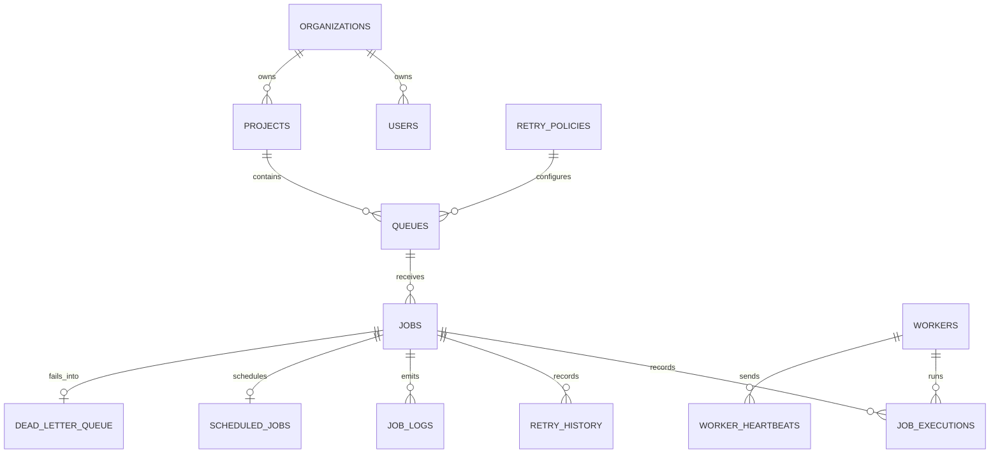

# ER Diagram and Schema Notes

## Keys and Relationships

- Every table uses an integer primary key for compact indexes and simple foreign keys.
- `users.organization_id`, `projects.organization_id`, `queues.project_id`, and job-related foreign keys enforce ownership boundaries.
- Cascading deletes remove child projects, queues, jobs, logs, schedules, and DLQ entries when an owning organization/project/queue is removed.
- `job_executions.worker_id` uses `ON DELETE SET NULL` so historical executions remain if a worker row is removed.

## Indexes

- `idx_jobs_claim(status, run_at, next_retry_at, queue_id)` supports worker polling for runnable jobs.
- `idx_jobs_queue_status(queue_id, status, created_at)` supports dashboard filtering and queue statistics.
- Unique constraints prevent duplicate emails, duplicate queue names within a project, and duplicate idempotency keys within a queue.

## Normalization

- Retry policies are normalized from queues so several queues can share a policy.
- Executions, retry history, worker heartbeats, logs, scheduled-job metadata, and DLQ entries are separate append-oriented tables for auditability.
- Jobs keep current lifecycle state for fast reads while history tables preserve details.

## Performance Considerations

- SQLite WAL mode improves concurrent readers while a worker is writing.
- Atomic claiming is intentionally small: select one eligible job inside a write transaction, update its status, then commit before execution.
- Queue concurrency is enforced during claim by counting active `claimed` and `running` jobs for that queue.
