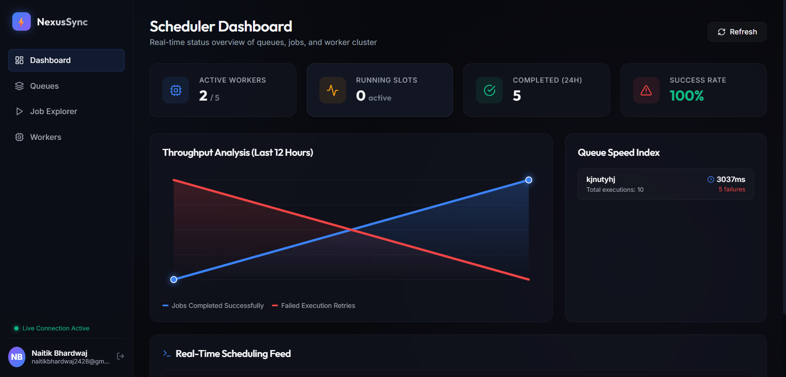
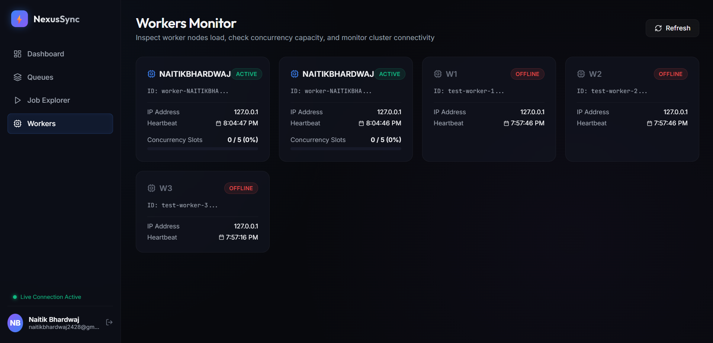
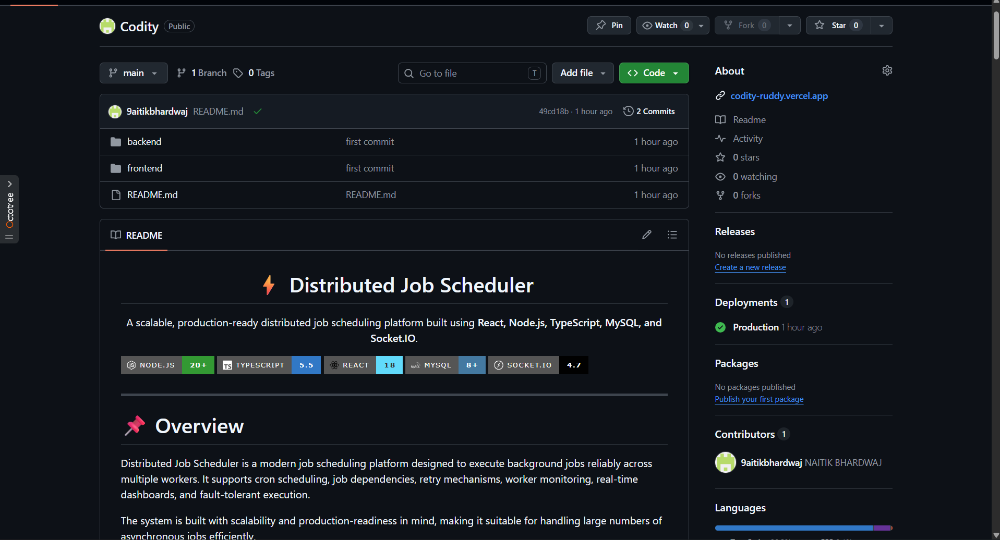

<h1 align="center">⚡ NexusSync - Distributed Job Scheduler</h1>

<p align="center">
A production-ready distributed job scheduling platform built with React, Node.js, TypeScript, MySQL, and Socket.IO.
</p>

<p align="center">


</p>

---

# 📖 Table of Contents

- Overview
- Features
- Project Screenshots
- Architecture
- Tech Stack
- Database Schema
- API Modules
- Installation
- Environment Variables
- Running the Project
- Folder Structure
- Future Enhancements
- Contributing
- License
- Author

---

# 🚀 Overview

**NexusSync** is a scalable distributed job scheduling platform that executes asynchronous workloads across multiple worker nodes. It supports cron scheduling, retry mechanisms, dead-letter queues, DAG-based workflows, worker monitoring, and a real-time analytics dashboard.

The application is designed with production-readiness, reliability, and horizontal scalability in mind.

---

# ✨ Features

## ⚙️ Scheduling Engine

- One-time job scheduling
- Cron-based recurring jobs
- Priority queues
- Atomic job claiming
- DAG workflow support
- Configurable concurrency

---

## 🔁 Fault Tolerance

- Fixed Delay Retry
- Linear Backoff
- Exponential Backoff
- Dead Letter Queue (DLQ)
- Automatic orphan recovery
- Worker heartbeat monitoring

---

## 📊 Dashboard

- Live analytics
- Queue overview
- Throughput charts
- Worker monitoring
- Success & Failure metrics
- Real-time updates

---

## 🔐 Security

- JWT Authentication
- Role-Based Access Control
- bcrypt Password Hashing

---

## ⚡ Real-Time

- Socket.IO
- Live worker heartbeat
- Queue updates
- Dashboard synchronization

---

# 📸 Project Screenshots

## Dashboard

<p align="center">

</p>

Real-time overview of queues, workers, throughput, execution statistics, and scheduling performance.

---

## Queue Manager

<p align="center">

</p>

Manage queues, retry policies, concurrency limits, priorities, and execution settings.

---

## Job Explorer

<p align="center">

</p>

Search, filter, trigger, and monitor scheduled jobs with execution history and retry status.

---

## Worker Monitor

<p align="center">

</p>

Monitor worker nodes, cluster health, heartbeat status, and concurrency utilization.

---

## GitHub Repository

<p align="center">

</p>

Repository structure including backend, frontend, documentation, and deployment.

---

# 🏗️ System Architecture

```
                    React Frontend
                           │
              REST API + Socket.IO
                           │
                 Express API Server
                           │
        ┌──────────────────┼─────────────────┐
        │                  │                 │
   Scheduler           Worker(s)         Analytics
        │                  │
        └──────────────┬───┘
                       │
                    MySQL Database
```

The system consists of four independent components:

- React Dashboard
- Express REST API
- Scheduler Service
- Worker Cluster

All services communicate through a shared MySQL database.

---

# 🛠️ Tech Stack

## Frontend

- React 18
- TypeScript
- Vite
- Socket.IO Client
- Lucide React

## Backend

- Node.js
- Express.js
- TypeScript
- Socket.IO
- JWT
- bcrypt
- mysql2

## Database

- MySQL 8

## Development Tools

- npm
- Nodemon
- ts-node
- Git
- GitHub

---

# 🗄️ Database Schema

The application contains the following tables:

| Table | Purpose |
|---------|----------|
| users | Authentication |
| organizations | Organizations |
| projects | Project Management |
| retry_policies | Retry Configurations |
| queues | Queue Configuration |
| jobs | Job Records |
| job_dependencies | DAG Workflows |
| workers | Worker Registry |
| job_executions | Execution History |
| dead_letter_queue | Failed Jobs |

---

# 📡 API Modules

## Authentication

- Register
- Login
- User Profile

## Jobs

- Create Job
- Trigger Job
- Retry Job
- Cancel Job
- Job History

## Queues

- Create Queue
- Pause Queue
- Resume Queue
- Delete Queue

## Workers

- Worker Status
- Heartbeats
- Cluster Monitoring

## Analytics

- Throughput
- Success Rate
- Queue Statistics
- DLQ Metrics

---

# ⚙️ Installation

## Clone Repository

```bash
git clone https://github.com/yourusername/nexussync.git
```

```
cd nexussync
```

---

## Install Backend

```bash
cd backend
npm install
```

---

## Install Frontend

```bash
cd frontend
npm install
```

---

# 🔧 Environment Variables

Create:

```
backend/.env
```

```env
PORT=5000

DB_HOST=localhost
DB_PORT=3306
DB_USER=root
DB_PASSWORD=yourpassword
DB_DATABASE=scheduler_db

JWT_SECRET=your_secret_key

NODE_ENV=development
```

---

# ▶️ Running the Project

## Backend API

```bash
cd backend
npm run dev
```

---

## Scheduler

```bash
cd backend
npm run scheduler
```

---

## Worker

```bash
cd backend
npm run worker
```

Multiple workers can be started for horizontal scaling.

---

## Frontend

```bash
cd frontend
npm run dev
```

Visit:

```
http://localhost:5173
```

---

# 📂 Folder Structure

```
NexusSync
│
├── assets
│   └── screenshots
│
├── backend
│   ├── src
│   ├── middleware
│   ├── schema.sql
│   ├── package.json
│   └── .env
│
├── frontend
│   ├── src
│   ├── components
│   ├── package.json
│   └── vite.config.ts
│
└── README.md
```

---

# 📈 Job Lifecycle

```
Queued
   │
   ▼
Scheduled
   │
   ▼
Claimed
   │
   ▼
Running
   │
   ├────────► Completed
   │
   └────────► Failed
                  │
                  ▼
              Retry Policy
                  │
                  ▼
          Dead Letter Queue
```

---

# 🌟 Future Enhancements

- Kubernetes Deployment
- Docker Support
- Email Notifications
- Slack Integration
- Distributed Cache (Redis)
- Prometheus Metrics
- Grafana Dashboard
- Multi-Tenant Support
- OAuth Authentication
- RabbitMQ/Kafka Integration

---

# 🤝 Contributing

Contributions are welcome!

1. Fork the repository

2. Create a new feature branch

```bash
git checkout -b feature/new-feature
```

3. Commit your changes

```bash
git commit -m "Added new feature"
```

4. Push the branch

```bash
git push origin feature/new-feature
```

5. Open a Pull Request

---

# 📄 License

This project is licensed under the MIT License.

---

# 👨‍💻 Author

**Naitik Bhardwaj**

B.Tech Computer Science & Engineering  
SRM Institute of Science and Technology

GitHub: https://github.com/9aitikbhardwaj

---

<p align="center">

⭐ If you like this project, don't forget to give it a star!

Made with ❤️ using React, Node.js & TypeScript.

</p>
